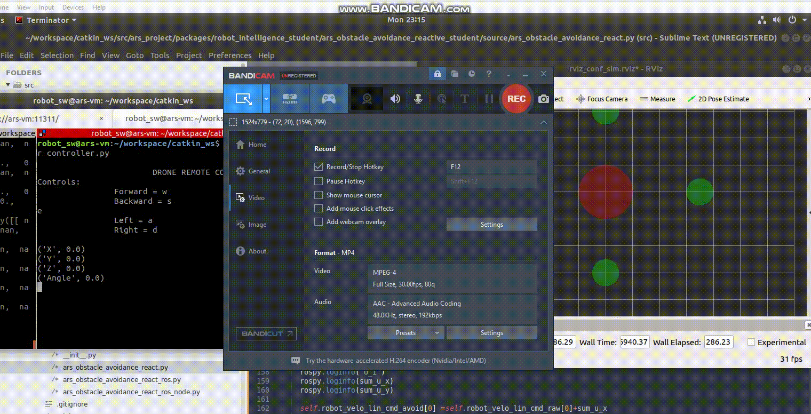

# Ars_msf_state_estimator
THis project will  develop a  multi-sensor  fusion state  estimator  based  on  an  Extended  Kalman  Filter (EKF),  to  combine  the  different  asynchronous  measurements  provided  by sensors. The algorithm will provide an estimate of the state of the robot, i.e. pose of the robot, and velocity of the robot in world frame, at a rate of 100 Hz.

The ROS package ars_sim_sensors_robotincludes three ROS nodes that simulate the aforementioned sensors, by publishing ROS messages with the measurements of the simulated sensors.
## Velocity sensorROS node:ars_sim_sensor_vel_robot_ros_node.py
Message type and topic name:/meas_robot_velocity_robot[Geometry_msgs/TwistStamped]
The sensor works at 25 Hz, and the measurements have a covariance of 0.01 in each dimension.
## Attitude sensorROS node:ars_sim_sensor_atti_robot_ros_node.py
Message type and topic name:/meas_robot_attitude[Geometry_msgs/QuaternionStamped]
The sensor works at 50 Hz, and the measurements have a covariance of 0.005in pitch and roll, and 0.05in yaw.
## Position sensorROS node: ars_sim_sensor_posi_robot_ros_node.py
Message type and topic name:/meas_robot_position[Geometry_msgs/PointStamped]
The sensor works at 1 Hz, and the measurements have a covariance of 0.05in each dimension.
## Demo
[]
